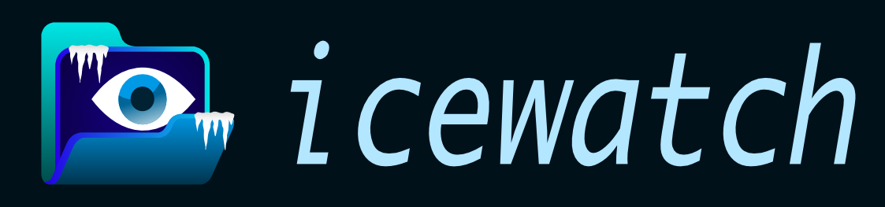

[](https://github.com/iced-rs/iced)


**icewatch** watches a directory — your Downloads folder, Desktop, or anywhere files pile up — and automatically sorts them into subfolders as they arrive. Set your rules once, forget about it.

Built with Rust and [Iced](https://github.com/iced-rs/iced).

---

## What it does

Files land in your Downloads folder in a chaotic heap. icewatch sits in the background, notices when something new arrives, and moves it to wherever it belongs — all while you're still in the middle of downloading it.

You define the rules: `.zip` and `.rar` go to `Archives/`, `.mp4` and `.mkv` go to `Videos/`, anything starting with `Invoice_` goes to `Documents/Finance/`. icewatch handles the rest.

It also keeps a journal of everything that happened — what moved, what was renamed, what you deleted — so you always know what the app did versus what you did yourself.

## Features

- **Live file watching** — reacts to new files the moment they appear, no polling
- **Smart download detection** — knows the difference between a finished download and a file that's still being written, across Chrome, Firefox, Opera, and Safari
- **Flexible sorting rules** — match files by extension, or by name prefix, suffix, or substring
- **Activity journal** — full history of file moves, renames, deletions, and completed downloads, filterable by today, yesterday, or all time
- **Empty folder cleanup** — optionally removes leftover empty directories after sorting
- **Theming** — 22 built-in themes plus custom themes via simple TOML files
- **Localization** — UI language detected automatically from your system locale

## Getting started

### Build from source

Requires Rust stable.

```bash
git clone https://github.com/Zira3l137/icewatch
cd icewatch
cargo build --release
```

Run the binary from the project root so it can find `resources/` and `app_config.toml`.

### Set up your rules

Open the Rules panel, hit **Add**, pick a criterion (by extension or by name), enter your destination folder, and save. Destinations are relative to your watched directory.

Examples:
- Extension `zip, rar, 7z` → `Archives`
- Extension `mp4, mkv, avi` → `Videos`
- Name contains `Invoice` → `Documents/Finance`

WARNING: As of now, sorting is disabled by default. Enable it in the Settings panel.

### Point it at a folder

Use the directory picker to select your watched folder and toggle watching on. That's it.

## Custom themes

Drop a `.toml` file into the `themes/` directory:

```toml
name       = "Everforest"
background = "#272E33"
text       = "#7A8478"
primary    = "#7FBBB3"
success    = "#A7C080"
danger     = "#E67E80"
warning    = "#DBBC7F"
```

It will appear in the theme selector on next launch alongside the 22 built-in themes.

## CLI options

```
-v, --verbosity <LEVEL>    Set log verbosity (trace, debug, info, warn, error)
    --log-to-file          Write logs to icewatch.log in addition to the console
```

## Roadmap

- [ ] More criteria for more granular sorting rules.
- [ ] System tray icon and notifications.

## Built with

- [iced](https://github.com/iced-rs/iced) — GUI framework
- [notify](https://github.com/notify-rs/notify) — filesystem watching
- [smol](https://github.com/smol-rs/smol) — async runtime
- [indexmap](https://github.com/indexmap-rs/indexmap) — ordered file registry
- [chrono](https://github.com/chronotope/chrono) — timestamps
- [rfd](https://github.com/PolyMeilex/rfd) — native file picker dialogs

## License

MIT
